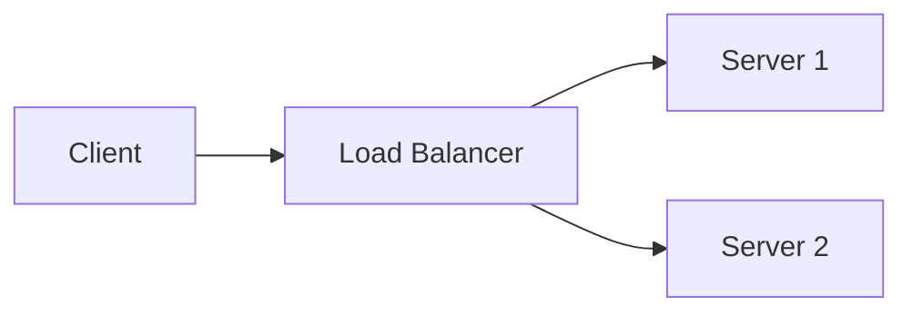

# Markdown Readability Best Practices

Complete guide to writing readable, scannable, and maintainable markdown documents.

## Table of Contents

- [Document Structure](#document-structure)
- [Heading Guidelines](#heading-guidelines)
- [Paragraph Best Practices](#paragraph-best-practices)
- [List Formatting](#list-formatting)
- [Code Block Standards](#code-block-standards)
- [Link Best Practices](#link-best-practices)
- [Table Formatting](#table-formatting)
- [Visual Elements](#visual-elements)
- [Line Length Guidelines](#line-length-guidelines)
- [Whitespace Management](#whitespace-management)
- [Typography Consistency](#typography-consistency)
- [Complete Example](#complete-example)

---

## Document Structure

### One H1 Per Document

**Rule**: Every document should have exactly one H1 heading (the main title).

❌ **Bad**:
```markdown
# Introduction
# Main Content
# Conclusion
```

✅ **Good**:
```markdown
# Document Title

## Introduction
## Main Content
## Conclusion
```

**Why**: H1 represents the document's main topic. Multiple H1s confuse document hierarchy and break SEO/accessibility.

### Sequential Heading Hierarchy

**Rule**: Never skip heading levels. Go H1 → H2 → H3 in order.

❌ **Bad**:
```markdown
# Title
### Subsection (skipped H2)
## Section (going backward)
```

✅ **Good**:
```markdown
# Title
## Section
### Subsection
#### Detail
```

**Why**: Screen readers and document parsers rely on sequential hierarchy. Skipping levels breaks navigation.

### Table of Contents

**When to use**: Documents > 300 lines or with > 5 main sections

**Format**:
```markdown
## Table of Contents

- [Introduction](#introduction)
- [Getting Started](#getting-started)
  - [Prerequisites](#prerequisites)
  - [Installation](#installation)
- [Usage](#usage)
- [API Reference](#api-reference)
```

**Auto-generate**: Use tools like `markdown-toc` or editor plugins.

### Logical Flow Pattern

**Recommended structure**:
```markdown
# Title

## Overview/Introduction
Quick summary (2-3 sentences)

## Prerequisites/Background
What readers need to know first

## Main Content
Core information organized by subtopics

## Examples/Tutorials
Practical applications

## Reference/API
Detailed technical information

## FAQ/Troubleshooting
Common issues and solutions

## Conclusion/Next Steps
Summary and related resources
```

---

## Heading Guidelines

### Capitalization

**Choose one style and stick to it**:

**Title Case** (recommended for formal docs):
```markdown
## Getting Started With the API
```

**Sentence case** (recommended for casual docs):
```markdown
## Getting started with the API
```

**Never**: `## getting started with the API` (lowercase)

### Length

**Rule**: Keep headings concise (< 8 words ideal)

❌ **Too long**:
```markdown
## How to Install and Configure the Application on Various Operating Systems Including Windows, macOS, and Linux
```

✅ **Concise**:
```markdown
## Installation Guide

Works on Windows, macOS, and Linux.
```

### Descriptive vs. Generic

❌ **Generic**:
```markdown
## Details
## Information
## More
```

✅ **Descriptive**:
```markdown
## API Authentication
## Configuration Options
## Advanced Usage Patterns
```

### Avoid Punctuation

❌ **Bad**:
```markdown
## Introduction:
## What is it?
## Getting Started!
```

✅ **Good**:
```markdown
## Introduction
## What is it
## Getting Started
```

**Exception**: Question headings in FAQ sections are acceptable.

---

## Paragraph Best Practices

### Length

**Rule**: 2-4 sentences per paragraph maximum

❌ **Too long**:
```markdown
This is a very long paragraph with many ideas. It discusses multiple concepts and topics. It goes on for many sentences without any breaks. The reader's eyes glaze over. They lose track of the main point. By the end they've forgotten what we were talking about. This makes the document hard to read and comprehend.
```

✅ **Right size**:
```markdown
This paragraph has a clear topic sentence. It develops the idea with 2-3 supporting sentences. It's easy to scan and comprehend.

New paragraphs separate distinct ideas. This improves readability significantly.
```

### Topic Sentences

**Pattern**: First sentence states the main idea.

✅ **Good**:
```markdown
The API requires authentication for all requests. You must include a valid API key in the Authorization header. Requests without authentication will receive a 401 error.
```

### One Idea Per Paragraph

❌ **Mixed topics**:
```markdown
The API supports JSON and XML formats. You need to authenticate with API keys. Rate limiting applies to all endpoints. HTTPS is required.
```

✅ **Separated**:
```markdown
The API supports both JSON and XML response formats. Specify your preference using the Accept header.

Authentication requires a valid API key in the Authorization header. Get your key from the dashboard.

Rate limiting applies to all endpoints. Free tier allows 100 requests per hour.
```

### Active Voice

❌ **Passive**:
```markdown
The configuration file is read by the application at startup. Settings are validated before being applied.
```

✅ **Active**:
```markdown
The application reads the configuration file at startup. It validates settings before applying them.
```

---

## List Formatting

### Consistent Markers

**Choose one style**:

✅ **Unordered (hyphen)**:
```markdown
- Item 1
- Item 2
- Item 3
```

✅ **Unordered (asterisk)**:
```markdown
* Item 1
* Item 2
* Item 3
```

❌ **Mixed**:
```markdown
- Item 1
* Item 2
- Item 3
```

**Recommendation**: Use `-` (hyphen) as it's more common in modern markdown.

### Ordered Lists

**Use for sequences, steps, or rankings**:

```markdown
1. First step
2. Second step
3. Third step
```

**Auto-numbering** (some parsers support):
```markdown
1. First step
1. Second step
1. Third step
```

### List Item Length

**Rule**: Keep items concise (1-2 lines)

❌ **Too long**:
```markdown
- This is a very long list item that goes on and on with multiple ideas and sentences that should probably be broken into sub-items or converted to a paragraph instead of remaining as a single list item
```

✅ **Right size**:
```markdown
- Configure authentication settings
  - Set API key in environment variables
  - Enable OAuth if needed
- Verify database connection
- Start the application
```

### Punctuation in Lists

**Choose one convention**:

**Option 1: No punctuation** (for short items):
```markdown
- Fast
- Reliable
- Secure
```

**Option 2: Full sentences with periods**:
```markdown
- This is a complete sentence.
- This is another complete sentence.
- This maintains consistency.
```

**Never**: Mix the two styles in the same list.

### Nested Lists

**Indent with 2 or 4 spaces** (be consistent):

```markdown
- Main item
  - Sub-item
    - Sub-sub-item
  - Another sub-item
- Another main item
```

---

## Code Block Standards

### Always Specify Language

❌ **No language**:
```markdown
```
const x = 1;
```
```

✅ **With language**:
```markdown
```javascript
const x = 1;
```
```

**Benefits**:
- Syntax highlighting
- Better accessibility
- Clearer context

### Common Language Tags

```markdown
```python
```javascript / ```js
```typescript / ```ts
```bash / ```shell
```json
```yaml / ```yml
```markdown / ```md
```html
```css
```sql
```go
```rust
```java
```
```

### Code Comments

**Add explanations for complex code**:

```markdown
```python
# Initialize the connection pool
pool = create_pool(
    host='localhost',
    port=5432,
    max_connections=10  # Limit to prevent resource exhaustion
)
```
```

### Show Output

**For examples, show expected results**:

```markdown
```python
print(sum([1, 2, 3]))
# Output: 6
```
```

Or use separate blocks:

```markdown
```python
print(sum([1, 2, 3]))
```

Output:
```
6
```
```

### Inline Code

**Use for**:
- Variable names: `variableName`
- Function names: `calculateTotal()`
- File names: `config.json`
- Commands: `npm install`
- Short code snippets: `const x = 1`

**Don't use for**:
- Emphasis (use **bold** or *italic*)
- Long sentences
- Multi-line code (use code blocks)

---

## Link Best Practices

### Descriptive Link Text

❌ **Generic**:
```markdown
Click [here](https://example.com) for more information.
Learn more [here](https://docs.example.com).
```

✅ **Descriptive**:
```markdown
See the [API documentation](https://example.com) for details.
Read the [installation guide](https://docs.example.com).
```

### Link Length

**Rule**: 2-5 words ideal

❌ **Too long**:
```markdown
[Read this comprehensive guide about how to install and configure the application](guide.md)
```

✅ **Concise**:
```markdown
Read the [installation guide](guide.md).
```

### Reference-Style Links

**For repeated links or long URLs**:

```markdown
Check out [React][react-docs] and [Vue][vue-docs] documentation.

[react-docs]: https://react.dev/learn
[vue-docs]: https://vuejs.org/guide/
```

### External Link Indicators

**Consider marking external links**:

```markdown
See [external documentation](https://external.com) 🔗
```

Or in reference style:
```markdown
[Google](https://google.com) (external)
```

### Link Verification

**Always verify**:
- [ ] All links work (no 404s)
- [ ] Internal links use relative paths
- [ ] Anchor links match actual heading IDs
- [ ] External links use HTTPS when available

---

## Table Formatting

### Basic Structure

```markdown
| Column 1 | Column 2 | Column 3 |
|----------|----------|----------|
| Data 1   | Data 2   | Data 3   |
| Data 4   | Data 5   | Data 6   |
```

### Alignment

```markdown
| Left-aligned | Center-aligned | Right-aligned |
|:-------------|:--------------:|--------------:|
| Text         | Text           | 123           |
| More text    | More text      | 456           |
```

- `:---` = left-aligned (default)
- `:---:` = center-aligned
- `---:` = right-aligned

### Column Width

**Keep columns readable**:

❌ **Too wide**:
```markdown
| This is an extremely long column header that makes the table hard to read | Short |
```

✅ **Balanced**:
```markdown
| Description | Value |
|-------------|-------|
| Long text goes in cells, not headers | 123 |
```

### When to Use Tables

**Good for**:
- Structured data comparisons
- Configuration options
- API parameters
- Feature matrices

**Bad for**:
- Long prose
- Complex nested data (use lists or JSON)
- Responsive mobile content

### Alternative: Definition Lists

**For key-value pairs**:

```markdown
**API Key**
: Your unique authentication token

**Rate Limit**
: 100 requests per hour

**Format**
: JSON or XML
```

---

## Visual Elements

### Images

**Always include alt text**:

```markdown

```

**With captions**:

```markdown

*Figure 1: Main application dashboard showing metrics*
```

### Image Sizing

**HTML for size control** (when supported):

```markdown

```

### Diagrams

**Use tools like Mermaid** (when supported):

```markdown

```

### Emoji Usage

**Be consistent**:
- Use sparingly
- Choose one set (GitHub emoji codes or Unicode)
- Avoid in professional/formal docs
- OK for status indicators: ✅ ❌ ⚠️ 📝

---

## Line Length Guidelines

### Recommended Limits

**Soft limit**: 80-100 characters
**Hard limit**: 120 characters

**Exceptions**:
- URLs (never break)
- Code blocks (preserve formatting)
- Tables (as needed)
- Long command examples

### Breaking Long Lines

**Markdown flows**, so you can break mid-sentence:

```markdown
This is a very long sentence that exceeds the line length limit
so we break it into multiple lines for better source readability
while maintaining a single paragraph in the output.
```

**Lists**:
```markdown
- This is a long list item that we can break
  across multiple lines by indenting continuation
- Next item
```

---

## Whitespace Management

### Blank Lines

**Rule**: Exactly one blank line between elements

✅ **Good**:
```markdown
# Heading

Paragraph text.

## Another Heading

More text.
```

❌ **Too many**:
```markdown
# Heading


Paragraph text.


## Another Heading
```

### Trailing Whitespace

**Rule**: No trailing spaces at end of lines

**Exception**: Two trailing spaces for hard line break (avoid this)

### File End

**Rule**: Single newline at end of file

Most linters and Git prefer this.

---

## Typography Consistency

### Emphasis

**Choose one style**:

**Option 1** (recommended):
- Bold: `**text**`
- Italic: `*text*`

**Option 2**:
- Bold: `__text__`
- Italic: `_text_`

**Never mix** `**bold**` with `__bold__` in same document.

### Quotes

**Use proper quotes**:
- Inline code: `` `code` ``
- Quotations: `> Quote text`
- String literals in text: Use "double" or 'single' consistently

### Horizontal Rules

**Choose one style**:
```markdown
---
```

Or:
```markdown
***
```

**Not**:
```markdown
___
```

---

## Complete Example

**Before** (poor readability):

```markdown
#getting started
This is a very long paragraph with no breaks that discusses installation and configuration and setup and many other topics all in one giant block of text.
###installation
```
npm install
```
###usage
[[other-doc]]
Check here for info
```

**After** (high readability):

```markdown
# Getting Started

## Overview

This guide covers installation and basic usage. You'll be up and running in 5 minutes.

## Installation

Install the package using npm:

```bash
npm install package-name
```

## Usage

Import and initialize:

```javascript
const Package = require('package-name');
const instance = new Package();
```

See the [configuration guide](other-doc.md) for advanced options.
```

---

**Best Practices Summary**:

✅ One H1 per document
✅ Sequential heading hierarchy
✅ 2-4 sentences per paragraph
✅ Consistent list markers
✅ Language tags on code blocks
✅ Descriptive link text
✅ Alt text on images
✅ One blank line between elements
✅ No trailing whitespace
✅ 80-120 character lines (when possible)
